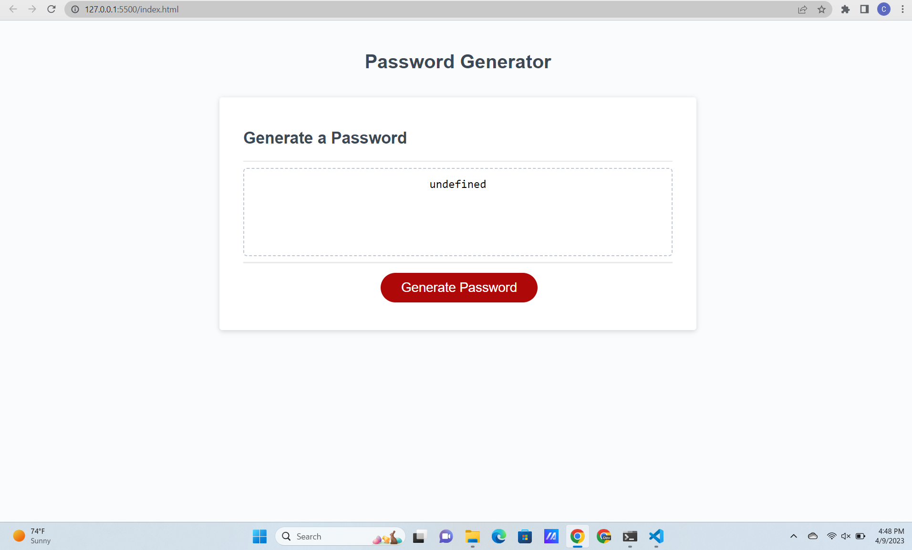

# <Password Generator>

## This application allows users to create randomly generated passwords based on criteria they set. 

## To use this application open it on a web broswer. Next click generate password. This will open a prompt where you choose how long you want the new password to be. After entering that it will ask if you want lowercase letters in the password. Click ok for yes and cancel for no. A similar prompt will popup three more times asking if you want uppercase letters, numbers, and special characters respectively. Select whatever you want and when you're done the password will generate in the box in the middle.

## https://corey-carpenter.github.io/password-generator/